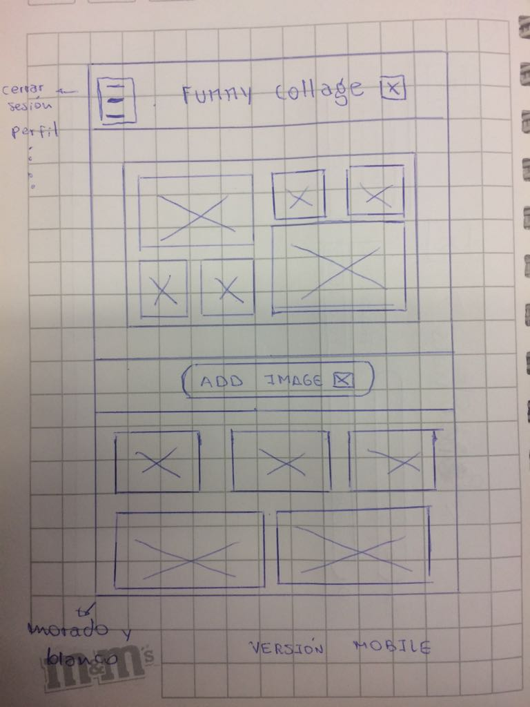
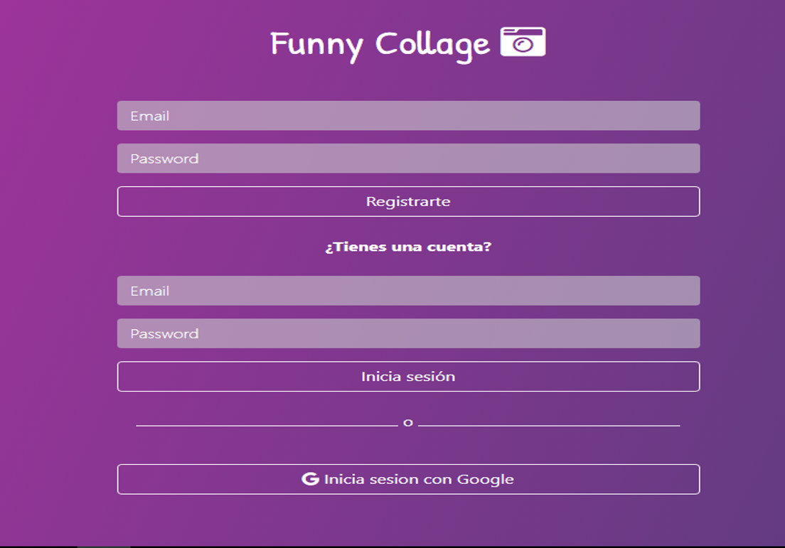
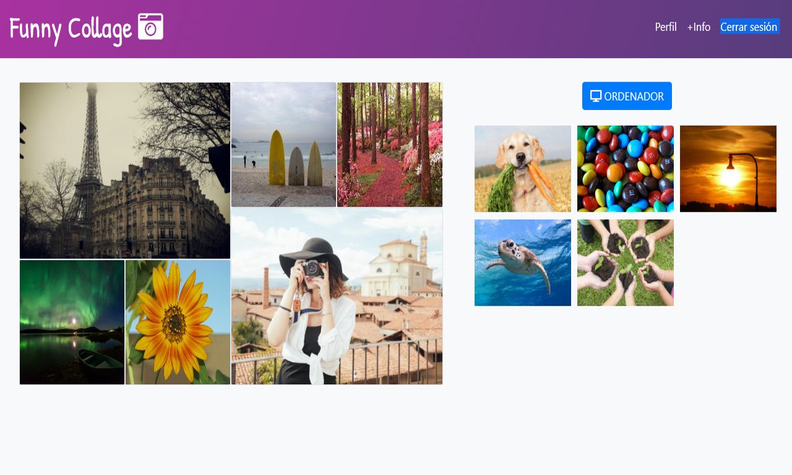

# FUNNY COLLAGE

* **Track:** _Common Core_
* **Curso:** _Construye una single page app (SPA) multiusuario consumiendo data remota_
* **Unidad:** _¿Qué hay de nuevo en HTLM5?_

***

## Introducción :
Este proyecto consiste en implementar una página en versión mobile donde el usuario puede arrastar fotos de un lugar la pagina hacia otro ,para construir un collage . Un requeriiento para este proyecto era hacer uso del _API : Drag and Drop_

## PLAN DE TRABAJO : 

El proyecto se realizó en un día y para ello se propuso dividir el proyecto en una serie de etapas que se detallarán a continuación :

#### ETAPA 1 : 
* Dibujar el sketch del proyecto ( imagen adjunta al final de esta etapa).
* Elección de colores y tipografías.
* Elección del nombre del proyecto ("Funny Collage")
* Crear issues y milestones que sirvan como hoja de ruta (roadmap).

#### ETAPA 2 :

* Crear repositorio del proyecto.
* Añadir frameworks necesarios .
* Maquetación vista login.
* Maquetacion vista principal.

### ETAPA 3 :
* Funcionalidad vista login (registro de usuarios con firebase correo y contraseña para la versión 1)

* Funcionalidad pagina principal.

### ETAPA 4 :

* Versión final README.

## Archivos importantes

El proyecto presenta los siguientes archivos para uso del usuario:

* `README.md` con descripción del proyecto, imagenes del mismo y organización del equipo.
* `index.html`: Donde se encuentra la vista de login.
* `main.css`: Archivo css que contiene los estilos del proyecto.
* `login.js`: Contiene toda la funcionalidad de la vista login.
* `app.js`: Contiene toda la funcionalidad de la pagina principal.

## Imagenes del proyecto :
* Vista login del proyecto:

* Vista principal :

## Demo
Para ver el demo dar click [aquí](https://escobar-flores.github.io/INSTA-COLLAGE/views/home/index.html "titulo")

## Autoras

* Rocci Escobar Nuñez [Cuenta GitHub](https://github.com/Rocciescobar "titulo")
* Manuela Flores Vilchez [Cuenta GitHub ](https://github.com/Manu160296 "titulo")

